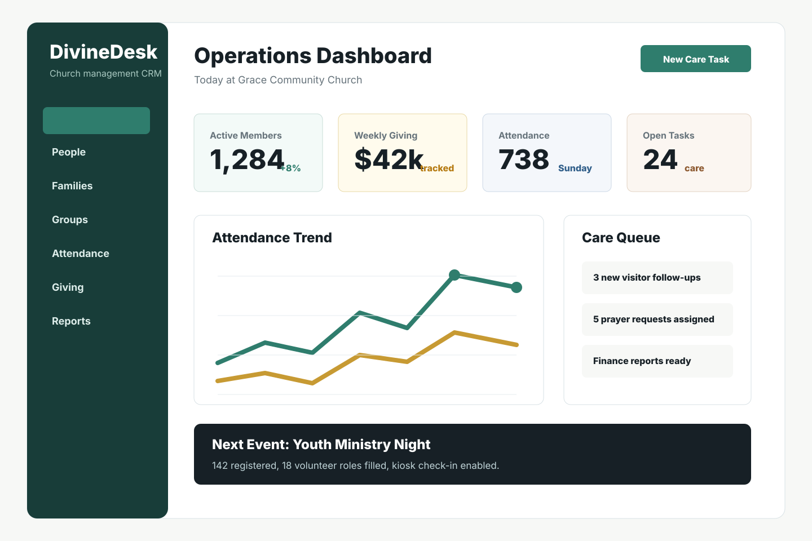
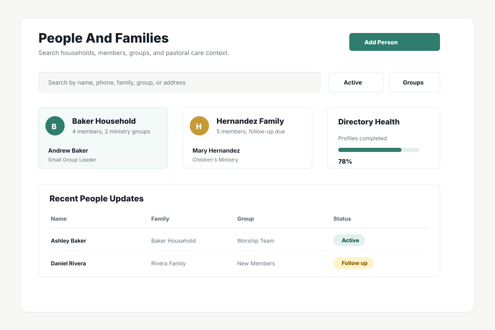
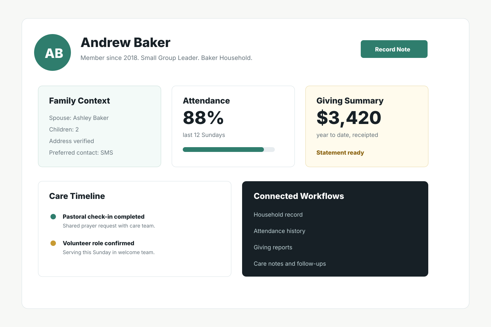
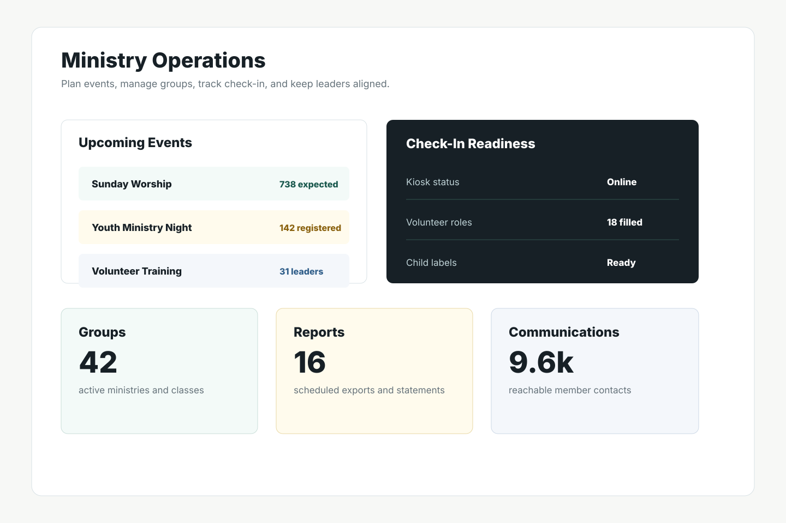

# DivineDesk CRM Case Study

Private source repository. Public portfolio case study.



## Overview

DivineDesk is a church-management CRM designed for congregations that need one organized workspace for people, families, groups, attendance, giving, communications, reports, and daily operations.

The project is built on the open-source ChurchCRM foundation and reworked into a calmer, branded product experience. My work focused on product positioning, frontend presentation, release packaging, local run documentation, and keeping the ChurchCRM compatibility boundary intact.

## My Role

Product engineer and full-stack implementer.

- Rebranded the application as DivineDesk while preserving ChurchCRM-compatible internals.
- Organized the product story around practical church operations rather than generic CRM language.
- Prepared a runnable local build package with Docker-based setup instructions.
- Maintained a privacy-conscious split between private source code and public portfolio evidence.
- Documented the architecture, technology decisions, validation commands, and user-facing workflows.

## Problem

Church teams often need operational software that is useful without feeling like enterprise sales tooling. The system had to keep proven ChurchCRM capabilities while making the product feel simpler, warmer, and more credible for non-technical church administrators.

## Solution

DivineDesk keeps the robust ChurchCRM core and presents it through a more focused product layer:

- People and family records for pastoral care and administration.
- Groups, ministries, classes, attendance, and check-in workflows.
- Events, calendars, kiosk flows, and communication tools.
- Giving, pledges, deposits, and finance reports.
- Plugin-compatible architecture and localization support.

## Screenshots

### Operations Dashboard


### People And Families



### Member Profile



### Ministry Operations



## Technical Highlights

- PHP application architecture with ChurchCRM-compatible namespaces and routes.
- JavaScript and TypeScript asset pipeline using Webpack.
- Bootstrap 5 and Tabler-inspired interface patterns.
- Docker-based local run package for reviewer-friendly demos.
- MySQL-backed CRM domain model with people, family, group, finance, event, and admin workflows.
- Localization-ready structure for multilingual church communities.

## Engineering Decisions

### Preserve Compatibility

Visible branding says DivineDesk, while internal technical identifiers remain ChurchCRM-compatible where they affect routes, APIs, database tables, generated assets, or ecosystem compatibility.

### Keep Source Private

The source repository is private because it contains the full application implementation and release workflow. This public repository is intentionally a case study: it shows the product, decisions, screenshots, and technical depth without exposing private source code.

### Make Local Review Possible

The private repository includes a runnable build package and manual so the project can be demonstrated locally with Docker using seeded demo data and a demo administrator account.

## Validation

The project includes standard validation commands for the private codebase:

```bash
npm run lint
npm run build:webpack
npm run build
```

The current source checkout already contains a release package under `dist/DivineDesk-7.4.0` and a shareable archive named `DivineDesk-7.4.0-shareable.zip`.

## Attribution

DivineDesk is built on the open-source ChurchCRM project. This case study describes the DivineDesk product layer, packaging, and portfolio presentation work while respecting the upstream project foundation.
